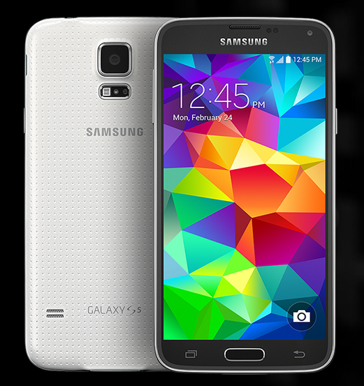
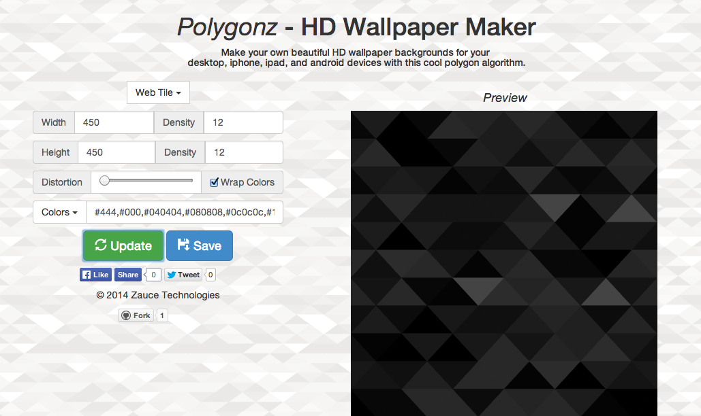

# Polygonz | Beautifully Algorithmic Backgrounds

## An Experiment with Dart
- Zach Nagengast www.github.com/ZachNagengast
- Live Demo: http://polygonz.zaucetech.com

## Description

Polygonz is a tool that creates beautiful and customizable polygon-styled backgrounds for your devices or webpages, algorithmically, built with Dart. It was inspired by a design trend which I will describe as geometric or polygon design. I thought the style looked really neat and wanted to do something in this area. 



With the launch of the S5, I was inspired to take action with this project. I loved this background, but wanted to make my own and customize it, which until now could only be done with photoshop. So I put my head down and after a while came up with this, hope you enjoy.



## Links

[Live Demo](www.zaucetech.com/polygonz)

[Main Repo (feel free to fork!)](http://www.github.com/ZachNagengast/polygonz)

[Pure Javascript Prototype Repo](https://github.com/ZachNagengast/polygonz/tree/javascript)

[First Version Demo (before name change)](http://zaucetech.com/fragmenter)

[Initial reddit post](http://www.reddit.com/r/javascript/comments/1zdje7/need_a_new_background_image_make_one_yourself/)


## Example Code
Polygonz works by creating a matrix of nodes and then looping through them to draw the triangles. This allows for future possibilities such as drawing squares or other various patterns. Code below shows how the matrix is made in Dart.

Html Code
```
<canvas id="canvas"></canvas>
```

Dart Code
```
//create node matrix
    var i, j, x = 0, y = 0, nodeMatrix = new List();
    for (i = 0; i < shapeCountX+1; i++) {
        var nodeMatrixInner = new List(shapeCountY);
        for (j = 0; j < shapeCountY; j++) {
            if(i<1 || i>=shapeCountX || j<1 || j>=shapeCountY-1){
                nodeMatrixInner[j] = [x*shapeWidth, y*shapeHeight];
            }else{
                var rnd = new Random();
                nodeMatrixInner[j] = [(x+distortion*(.5-rnd.nextDouble()))*shapeWidth, (y+distortion*(.5-rnd.nextDouble()))*shapeHeight];
            }
            y=y+1;
        }
        nodeMatrix.add(nodeMatrixInner);
        x=x+1;
        y=0;
    }
    
    var canvas = document.getElementById("canvas");
    //setup the canvas
    canvas.width = canvasWidth;
    canvas.height = canvasHeight;
    
    //draw the image
    drawImage(nodeMatrix);
    
    print("Updarted");
```

## Outside Links

[Dart](https://www.dartlang.org/)

[Canvas2Image](http://www.nihilogic.dk/labs/canvas2image/)


## Images & Videos
Various demos


Inspirations


